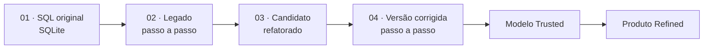
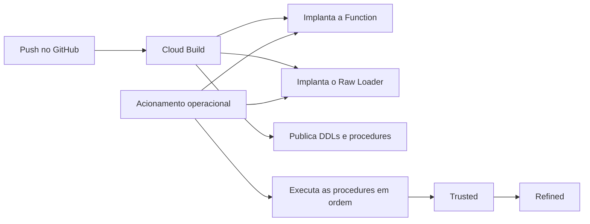
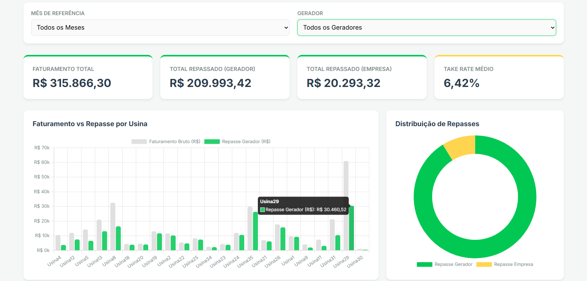
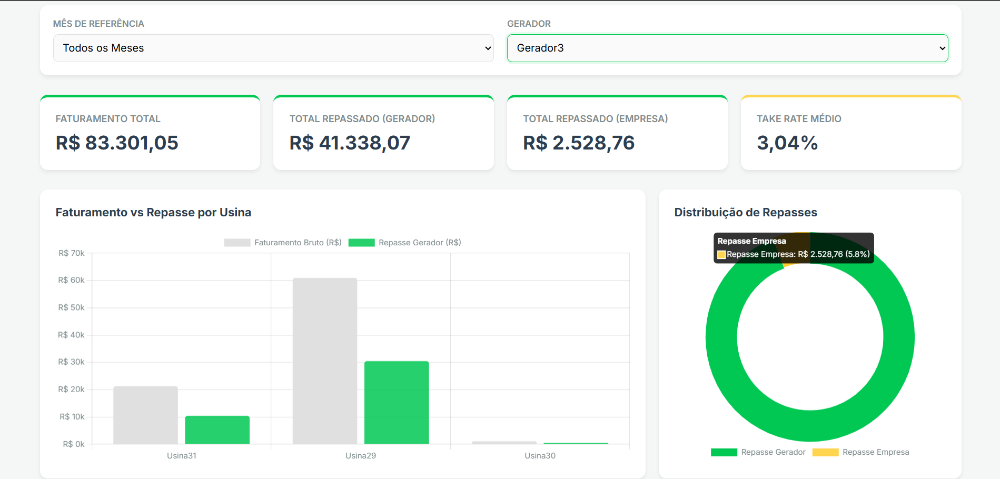

# Lemon Generator Report

Produto de dados desenvolvido para o case de Analytics Engineering da Lemon.
A solução parte do SQLite disponibilizado no endpoint do desafio, preserva a
fonte, organiza as informações em uma arquitetura Medallion e publica o
Relatório do Gerador em um contrato simples para consumo analítico.

## Produto entregue

O produto principal é:

```text
refined.relatorio_gerador_mensal
```

Seu grain é uma linha por gerador, usina, distribuidora e mês de referência. A
view `refined.vw_relatorio_gerador_apresentacao` seleciona e formata as métricas
necessárias para visualização, sem alterar o grain do produto.

O produto responde, entre outras, às seguintes perguntas:

- quanto foi cobrado e liquidado para cada gerador;
- qual foi o desempenho mensal de cada usina;
- qual faixa de take rate foi aplicada;
- quanto pertence à Lemon e quanto deve ser repassado ao gerador;
- quanto foi descontado de TUSD;
- quanto de multa e juros pertence a cada parte.

Veja o contrato completo em [Produto de dados](docs/data_product.md).

## Arquitetura implementada

```mermaid
flowchart LR
    A[Endpoint HTTPS<br/>publicado no Notion]
    B[Cloud Run Function<br/>source_ingestion]
    C[Cloud Storage<br/>landing imutável]
    D[Cloud Run Job<br/>sqlite_to_raw]
    E[BigQuery<br/>raw]
    F[BigQuery<br/>trusted]
    G[BigQuery<br/>refined]
    H[View de apresentação]

    A -->|URL protegida no Secret Manager| B
    B -->|valida e identifica por SHA-256| C
    C --> D
    D -->|8 tabelas + _ingested_at| E
    E -->|tipagem e padronização| F
    F -->|métricas e regras finais| G
    G --> H
```



### Responsabilidades

- `functions/source_ingestion`: baixa, valida e preserva o SQLite na landing;
- `jobs/sqlite_to_raw`: lê a landing e materializa as oito tabelas Raw;
- `sql/ddl` e `sql/procedures`: definem e carregam Trusted e Refined;
- `sql/view/refined`: expõe a visão de apresentação do produto;
- `sql/validation`: preserva a engenharia reversa e as versões de comparação;
- `docs`: registra descoberta, contratos, arquitetura e operação.

A landing preserva os bytes originais; a camada Raw começa somente quando as
tabelas são materializadas no BigQuery.

## Camadas de dados

| Camada | Papel | Estado |
|---|---|---|
| Landing | Preservação imutável do SQLite por SHA-256 | Implementada e validada |
| Raw | Oito tabelas com nomes da fonte e `_ingested_at` | Implementada e carregada |
| Trusted | Tipagem, temporalidade D+60, deduplicação e integração | 12 tabelas e 12 procedures |
| Refined | Fechamento imutável, take rate, TUSD e repasses | Tabela, procedure e view implementadas |
| Validation | Paridade, diagnóstico e candidatos da engenharia reversa | Artefatos SQL de apoio |

## Engenharia reversa e validação

Os quatro primeiros scripts em `sql/validation` contam a sequência de
engenharia reversa:



Eles demonstram como a view foi compreendida, quais problemas técnicos foram
encontrados e como a proposta final foi alcançada. Não representam quatro
produtos concorrentes. Os scripts `05` e `06` validam a temporalidade D+60 e o
fechamento Refined. Veja [Validação e entendimento](docs/validation/README.md).

O resultado original possui 10 linhas porque a TUSD determina quais usinas
chegam à saída. O produto Refined preserva as 23 usinas operacionais e mantém a
ausência de TUSD explícita, sem descartar a linha. A análise e os CSVs utilizados
como evidência estão em [Comparação dos resultados](docs/validation/generator_report_result_comparison.md).

## Princípios da solução

- fonte preservada de forma idempotente e endereçada por SHA-256;
- URL do endpoint protegida no Secret Manager;
- Raw fiel à estrutura física da fonte;
- nomes e tipos semânticos tratados na Trusted;
- valores financeiros convertidos de centavos para reais;
- instrumentos agregados antes dos joins para evitar fanout;
- competência e mês de liquidação preservados separadamente;
- fechamento após 60 dias corridos do vencimento;
- faixa de take rate aplicada somente na Refined;
- SQL, DDLs e procedures versionados no GitHub;
- implantação automatizada pelo Cloud Build;
- execução operacional das cargas por acionamento manual;
- Airflow previsto para a orquestração ponta a ponta.

## Estrutura do repositório

```text
./
├── functions/
│   └── source_ingestion/         # Endpoint → landing
├── jobs/
│   └── sqlite_to_raw/            # Landing → BigQuery Raw
├── sql/
│   ├── ddl/
│   │   ├── trusted/
│   │   └── refined/
│   ├── procedures/
│   │   ├── trusted/
│   │   └── refined/
│   ├── validation/               # Engenharia reversa e reconciliação
│   └── view/
│       └── refined/              # Contrato de apresentação
├── docs/
│   ├── discovery/
│   ├── trusted/
│   ├── refined/
│   ├── validation/
│   ├── architecture.md
│   ├── data_product.md
│   └── runbook.md
└── cloudbuild*.yaml
```

## CI/CD e execução

| Pipeline | Destino |
|---|---|
| `cloudbuild.yaml` | Cloud Run Function `lemon-source-ingestion` |
| `cloudbuild-sqlite-to-raw.yaml` | Cloud Run Job `lemon-sqlite-to-raw` |
| `cloudbuild-ddl-trusted.yaml` | Tabelas Trusted |
| `cloudbuild-procedures-trusted.yaml` | Procedures Trusted |
| `cloudbuild-ddl-refined.yaml` | Tabela Refined |
| `cloudbuild-procedures-refined.yaml` | Procedure Refined |



O Cloud Build implanta os componentes e publica os objetos SQL. O acionamento
do Raw Loader e a execução ordenada das stored procedures são operações
manuais, descritas no [Runbook](docs/runbook.md).

## Testes locais

```powershell
python -m venv .venv
.\.venv\Scripts\Activate.ps1
python -m pip install --upgrade pip

python -m pip install -r functions/source_ingestion/requirements.txt
python -m unittest discover -s functions/source_ingestion/tests -v

python -m pip install -r jobs/sqlite_to_raw/requirements.txt
python -m unittest discover -s jobs/sqlite_to_raw/tests -v
```

## Documentação

- [Produto de dados](docs/data_product.md)
- [Arquitetura e decisões](docs/architecture.md)
- [Runbook operacional](docs/runbook.md)
- [Descoberta das fontes](docs/discovery/)
- [Catálogo Trusted](docs/trusted/README.md)
- [Contrato Refined](docs/refined/README.md)
- [Validação e entendimento](docs/validation/README.md)

## Dash simples em html e js

 

