# Lemon Generator Report

Solução do case de Analytics Engineering da Lemon Energia para construir um
produto de dados a partir da engenharia reversa da view `generator_report`.

O projeto preserva o arquivo SQLite original, carrega suas oito tabelas na
camada `raw` do BigQuery e prepara a base para as transformações `trusted` e
`refined` que responderão às perguntas analíticas do case.

## Estado atual

| Componente | Estado |
|---|---|
| Ingestão HTTP da fonte | Implementado, testado e implantado |
| Preservação imutável no Cloud Storage | Implementado e validado |
| CI/CD da ingestão | Implementado e validado |
| Dataset `raw` no BigQuery | Criado |
| Loader SQLite → `raw` | Implementado e testado localmente |
| Container e CI/CD do Raw Loader | Em implantação |
| Camadas `trusted` e `refined` | Planejadas |
| Orquestração ponta a ponta | Evolução futura |

## Arquitetura

```mermaid
flowchart LR
    A[URL HTTPS protegida<br/>Secret Manager]
    B[Cloud Run Function<br/>lemon-source-ingestion]
    C[Cloud Storage landing<br/>SQLite imutável]
    D[Cloud Run Job<br/>lemon-sqlite-to-raw]
    E[BigQuery<br/>raw]
    F[Dataform<br/>trusted]
    G[Dataform<br/>refined]
    H[Relatório do gerador]

    A --> B
    B -->|valida, calcula SHA-256 e preserva| C
    C -->|snapshot selecionado| D
    D -->|8 tabelas + _ingested_at| E
    E -. próximo incremento .-> F
    F -. próximo incremento .-> G
    G -.-> H
```



As responsabilidades foram separadas deliberadamente:

- a Cloud Run Function recebe a requisição e preserva a fonte;
- o Cloud Run Job executa uma carga batch finita e encerra;
- o BigQuery armazena as camadas analíticas;
- o Dataform será responsável somente pelas transformações SQL.

O bucket de landing não é a camada `raw`. Ele preserva os bytes originais para
auditoria e replay; `raw` começa quando as tabelas são materializadas no
BigQuery.

## Organização dos dados

O BigQuery usa a hierarquia `projeto.dataset.tabela`. Para o escopo do case, o
projeto e o dataset são:

```text
lemon-ae-case.raw
```

Os domínios já estão explícitos nos nomes fornecidos pela origem:

```text
energy_clients
energy_farms
energy_generator_take_rates
finance_billings
finance_boletos
finance_charges
finance_pixs
finance_relations
```

O loader preserva os nomes e colunas da fonte e acrescenta somente
`_ingested_at TIMESTAMP`. Cada execução usa `WRITE_TRUNCATE`, reconstruindo o
estado da camada `raw` a partir do snapshot imutável selecionado.

## Principais decisões

- **Fonte imutável:** o SHA-256 do conteúdo compõe o caminho no Cloud Storage.
- **Idempotência na landing:** `if_generation_match=0` impede sobrescrita.
- **Segredo fora do Git:** a URL HTTPS é lida do Secret Manager.
- **Identidades dedicadas:** ingestão, carga raw e implantação usam contas de
  serviço distintas e permissões com o menor escopo prático.
- **Componentes independentes:** cada unidade implantável possui suas próprias
  dependências, testes e processo de build.
- **Carga previsível:** o schema do BigQuery é derivado dos tipos declarados no
  SQLite, sem autodetecção baseada em amostra.
- **Sem pandas no loader:** a extração gera NDJSON por streaming, reduzindo o
  tamanho da imagem e o consumo de memória.
- **Uma camada por dataset:** neste case, os datasets serão `raw`, `trusted` e
  `refined`; os domínios permanecem nos nomes das tabelas.

Os detalhes, alternativas consideradas e limites estão em
[Arquitetura e decisões](docs/architecture.md).

## Estrutura do repositório

```text
./
├── functions/
│   └── source_ingestion/
│       ├── main.py
│       ├── ingestion_core.py
│       ├── requirements.txt
│       └── tests/
│           └── test.py
├── jobs/
│   └── sqlite_to_raw/
│       ├── main.py
│       ├── sqlite_loader.py
│       ├── requirements.txt
│       ├── Dockerfile
│       ├── .dockerignore
│       └── tests/
│           └── test_sqlite_loader.py
├── docs/
│   ├── architecture.md
│   └── runbook.md
├── cloudbuild.yaml
├── cloudbuild-sqlite-to-raw.yaml
├── .gitignore
└── README.MD
```

Convenções adotadas:

- diretórios e módulos Python: `snake_case`;
- recursos do Google Cloud: `kebab-case`;
- pipelines adicionais: `cloudbuild-<componente>.yaml`.

O arquivo `cloudbuild.yaml` mantém o nome original porque o gatilho de ingestão
já implantado aponta para ele. O pipeline novo segue o nome explícito
`cloudbuild-sqlite-to-raw.yaml`.

## Testes locais

Crie um ambiente virtual na raiz do repositório:

```powershell
python -m venv .venv
.\.venv\Scripts\Activate.ps1
python -m pip install --upgrade pip
```

Função de ingestão:

```powershell
python -m pip install -r functions/source_ingestion/requirements.txt
python -m unittest discover -s functions/source_ingestion/tests -v
```

Raw Loader:

```powershell
python -m pip install -r jobs/sqlite_to_raw/requirements.txt
python -m unittest discover -s jobs/sqlite_to_raw/tests -v
```

O resultado atual esperado é `3` testes da ingestão e `4` testes do loader,
todos com status `OK`. A pasta `.venv` e os artefatos `__pycache__` são locais e
não devem ser versionados.

## Implantação

| Pipeline | Origem | Destino |
|---|---|---|
| `cloudbuild.yaml` | `functions/source_ingestion` | Cloud Run Function `lemon-source-ingestion` |
| `cloudbuild-sqlite-to-raw.yaml` | `jobs/sqlite_to_raw` | Cloud Run Job `lemon-sqlite-to-raw` |

O pipeline da função executa testes e faz deploy por código-fonte. O pipeline do
job executa testes, constrói a imagem pelo `Dockerfile`, publica no Artifact
Registry `lemon-data-pipelines` e atualiza a definição do Cloud Run Job. O
deploy do job não inicia a carga automaticamente.

O procedimento reproduzível, os comandos de IAM, as validações operacionais e
os problemas já corrigidos estão no [Runbook](docs/runbook.md).

## Próximos incrementos

1. Implantar e executar o Raw Loader, validando as oito tabelas no BigQuery.
2. Versionar a engenharia reversa da view `generator_report`.
3. Implementar testes e transformações `trusted` no Dataform.
4. Construir as tabelas e métricas `refined` solicitadas pelo case.
5. Adicionar observabilidade e uma orquestração ponta a ponta; Airflow é uma
   opção de evolução, não uma dependência do MVP atual.

## Documentação

- [Arquitetura e decisões](docs/architecture.md)
- [Runbook, verificações e troubleshooting](docs/runbook.md)
