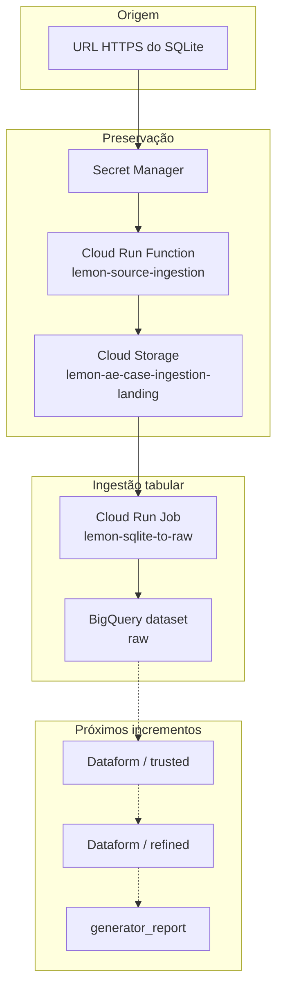

# Arquitetura e decisões

## Contexto

O case parte de um arquivo SQLite disponibilizado por uma URL HTTPS e de uma
view chamada `generator_report`, cuja lógica deverá ser reproduzida e evoluída
em uma arquitetura analítica no Google Cloud.

O desenho separa preservação da fonte, ingestão tabular e transformação
analítica. Essa separação permite reprocessar o dado original, testar cada
fronteira isoladamente e evoluir as regras de negócio sem acoplar o endpoint de
origem ao BigQuery.

## Escopo atual



## Componentes e responsabilidades

### Cloud Run Function: source ingestion

Responsável por:

1. receber uma chamada HTTP autenticada;
2. obter a URL da fonte pelo Secret Manager;
3. baixar o arquivo por streaming para o filesystem temporário;
4. limitar o download a 50 MiB;
5. validar o cabeçalho SQLite e executar `PRAGMA integrity_check`;
6. calcular o SHA-256 do conteúdo;
7. criar o objeto imutável no bucket de landing.

O uso de `tempfile.TemporaryDirectory` implica armazenamento efêmero,
normalmente em `/tmp` no Cloud Run. O arquivo local existe apenas durante a
requisição e não representa uma camada de persistência.

O caminho determinístico atual é:

```text
gs://lemon-ae-case-ingestion-landing/
└── generator-report/sqlite/
    └── sha256=e42e7355e0783525cfb40364f698e8bef86f4b26925178a9316570fb4982dc1b/
        └── Lemon_Case_Tecnico_AE.db
```

O upload utiliza `if_generation_match=0`. Uma nova chamada com os mesmos bytes
retorna `already_exists` e não sobrescreve o objeto.

### Cloud Run Job: SQLite to raw

Responsável por:

1. baixar um snapshot imutável do bucket;
2. abrir o SQLite em modo somente leitura;
3. executar `PRAGMA quick_check`;
4. descobrir tabelas reais em `sqlite_master`, ignorando views e objetos
   internos;
5. exigir exatamente oito tabelas;
6. validar nomes compatíveis com o BigQuery;
7. gerar NDJSON por streaming com schema explícito;
8. carregar cada tabela com `WRITE_TRUNCATE`;
9. comparar a contagem exportada com a contagem carregada.

Todas as exportações locais são preparadas antes do primeiro load no BigQuery.
Isso impede que um erro de schema descoberto localmente produza uma carga
parcial. Os oito loads são independentes; atomicidade global entre tabelas é
uma evolução possível com tabelas de staging e promoção controlada.

O job possui uma única task e não atende HTTP. Implantar ou atualizar o job não
executa a carga.

## Contrato da camada raw

As oito tabelas esperadas são:

| Domínio | Tabelas |
|---|---|
| Energy | `energy_clients`, `energy_farms`, `energy_generator_take_rates` |
| Finance | `finance_billings`, `finance_boletos`, `finance_charges`, `finance_pixs`, `finance_relations` |

Os nomes das tabelas e colunas da fonte são preservados. O único metadado
adicionado ao conteúdo é `_ingested_at TIMESTAMP`, igual para todas as linhas de
uma execução.

Mapeamento dos tipos declarados no SQLite:

| SQLite | BigQuery |
|---|---|
| `INTEGER` | `INTEGER` |
| `REAL`, `FLOAT`, `DOUBLE` | `FLOAT` |
| `BOOLEAN` | `BOOLEAN` |
| `NUMERIC`, `DECIMAL` | `NUMERIC` |
| `BLOB` | `BYTES` |
| Demais tipos | `STRING` |

Campos de data e hora declarados como texto continuam como `STRING` na `raw`.
A interpretação semântica e conversão para `DATE`, `DATETIME` ou `TIMESTAMP`
pertencem à camada `trusted`.

## Organização no BigQuery

Para o case, a organização é orientada por camada:

```text
Projeto GCP: lemon-ae-case
├── Dataset: raw
├── Dataset: trusted  (planejado)
└── Dataset: refined  (planejado)
```

Não existem datasets aninhados no BigQuery. Os domínios `energy` e `finance`
permanecem nos prefixos das tabelas. Um dataset separado só se justifica quando
houver diferença real de acesso, proprietário, localização, retenção ou ciclo
de vida.

Em uma plataforma corporativa maior, uma alternativa seria representar a
camada em projetos distintos, por exemplo `lemon-data-raw-prod`, e representar
os domínios como datasets. Essa complexidade não é necessária para o escopo do
case.

## Identidades e acessos

Nenhuma chave JSON de conta de serviço é criada. Os componentes usam
Application Default Credentials fornecidas pelo ambiente do Google Cloud.

| Identidade | Finalidade | Acessos de dados |
|---|---|---|
| `sa-lemon-source-ingestion` | Executar a função de ingestão | `Storage Object Creator` no bucket de landing e `Secret Manager Secret Accessor` no segredo da URL |
| `sa-lemon-raw-loader` | Executar o job de carga | `Storage Object Viewer` no bucket, `BigQuery Job User` no projeto e `BigQuery Data Editor` somente no dataset `raw` |
| `sa-lemon-cloud-build-deployer` | Testar, construir e implantar | escrita no repositório `lemon-data-pipelines`, administração de deploy no Cloud Run e permissão para usar as duas identidades de runtime |

A Default Compute Service Account foi criada automaticamente pelo Google
Cloud, mas não é a identidade escolhida para os componentes da solução.

## Repositórios de imagens

Existem dois repositórios Docker com finalidades distintas:

| Repositório | Origem | Uso |
|---|---|---|
| `cloud-run-source-deploy` | Criado automaticamente pelo Cloud Run | Imagens produzidas pelo deploy por código-fonte da função |
| `lemon-data-pipelines` | Criado explicitamente para o case | Imagens Docker versionadas dos jobs de dados |

O primeiro apareceu quando `gcloud run deploy --source` foi executado. Esse
comando usa Cloud Build/Buildpacks e cria `cloud-run-source-deploy` quando o
repositório regional ainda não existe. Ele não deve ser confundido com o
repositório explícito do Raw Loader.

A verificação paga de vulnerabilidades está desativada no MVP. Em produção,
ela pode ser ativada junto com política de retenção e bloqueio de imagens com
vulnerabilidades críticas.

## CI/CD

### Source ingestion

O gatilho `deploy-lemon-source-ingestion` acompanha a branch `main` e usa
`cloudbuild.yaml`. O pipeline executa testes e implanta a função. O comando de
deploy informa explicitamente a conta usada no build interno para evitar
fallback para a Default Compute Service Account.

### SQLite to raw

O pipeline `cloudbuild-sqlite-to-raw.yaml`:

1. executa os testes do loader;
2. constrói a imagem pelo `Dockerfile`;
3. publica a tag associada ao commit no `lemon-data-pipelines`;
4. cria ou atualiza `lemon-sqlite-to-raw`;
5. não executa o job automaticamente.

O gatilho específico do Raw Loader será filtrado para alterações em
`jobs/sqlite_to_raw/**` e no próprio arquivo do pipeline.

## Limites e parâmetros atuais

| Parâmetro | Valor |
|---|---:|
| Região | `southamerica-east1` |
| Download máximo da fonte | 50 MiB |
| Timeout da função | 300 s |
| Concorrência da função | 1 |
| Máximo de instâncias da função | 1 |
| Tabelas esperadas no SQLite | 8 |
| Tasks do Raw Loader | 1 |
| Paralelismo do Raw Loader | 1 |
| Retry do Raw Loader | 1 |
| Timeout da task | 600 s |
| CPU / memória do Raw Loader | 1 vCPU / 1 GiB |

Esses valores são adequados ao arquivo atual de aproximadamente 5,2 MB. Antes
de ampliar volume ou frequência, devem ser revistos com métricas reais de
tempo, memória e custo.

## Evoluções planejadas

- transformar e testar os tipos semânticos na `trusted`;
- reproduzir a lógica da `generator_report` no Dataform;
- construir a camada `refined` e as análises solicitadas;
- aplicar labels nas tabelas para camada, fonte e domínio;
- introduzir staging para promoção atômica das oito tabelas, se necessário;
- adicionar alertas e retenção de imagens;
- orquestrar o fluxo completo. Airflow é uma opção futura, após o fluxo manual
  estar validado e suas dependências estarem claras.
