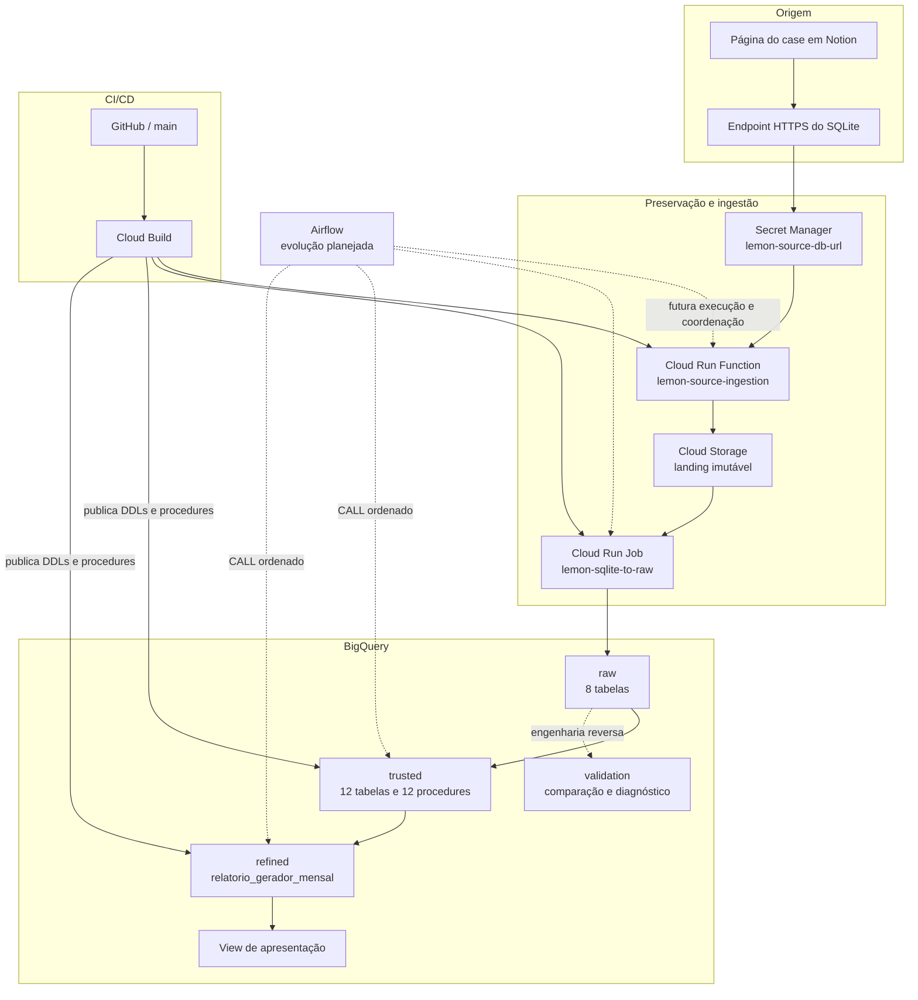

# Arquitetura e decisões

## Contexto

O case parte de um arquivo SQLite disponibilizado por um endpoint HTTPS na
página do desafio publicada em Notion. A solução preserva o arquivo original,
materializa suas oito tabelas no BigQuery e transforma os dados até o relatório
mensal do gerador.

A arquitetura separa preservação, ingestão tabular, padronização e produto de
dados. Assim, a fonte pode ser auditada e reprocessada, enquanto as regras
analíticas evoluem como SQL versionado no GitHub.

## Estado atual



As setas contínuas representam os componentes e fluxos implementados. As setas
tracejadas identificam a evolução de orquestração prevista com Airflow.

## Fluxo de dados

### 1. Origem

O endereço de download vem do endpoint publicado no site do case, construído
em Notion. A URL não fica no código: é armazenada no Secret Manager como
`lemon-source-db-url` e disponibilizada somente à identidade da função.

### 2. Preservação imutável

A Cloud Run Function `lemon-source-ingestion` recebe uma chamada autenticada,
lê a URL no Secret Manager, baixa o arquivo com limite de 50 MiB, valida o
SQLite, calcula seu SHA-256 e cria o objeto no bucket de landing.

```text
gs://lemon-ae-case-ingestion-landing/
└── generator-report/sqlite/
    └── sha256=<HASH_DO_CONTEUDO>/
        └── Lemon_Case_Tecnico_AE.db
```

O bucket preserva bytes e não é a camada Raw. O upload usa
`if_generation_match=0`; conteúdo repetido retorna `already_exists` e nunca
sobrescreve o objeto existente.

### 3. Ingestão tabular na Raw

O Cloud Run Job `lemon-sqlite-to-raw` baixa o snapshot, abre o SQLite em modo
somente leitura, valida sua integridade, gera NDJSON com schema explícito e
carrega cada tabela com `WRITE_TRUNCATE`. A contagem exportada é comparada com a
contagem carregada.

| Domínio | Tabelas Raw |
|---|---|
| Energia | `energy_clients`, `energy_farms`, `energy_generator_take_rates` |
| Financeiro | `finance_billings`, `finance_boletos`, `finance_charges`, `finance_pixs`, `finance_relations` |

A Raw preserva nomes e tipos físicos da fonte e acrescenta somente
`_ingested_at TIMESTAMP`. Datas textuais continuam como `STRING`; a conversão
semântica pertence à Trusted.

### 4. Padronização na Trusted

O dataset `trusted` está criado e possui DDLs e procedures versionados. A camada
converte tipos, padroniza nomes e textos, converte centavos para reais,
deduplica registros e cria entidades integradas.

| Grupo | Tabelas Trusted |
|---|---|
| Energia | `cliente_energia_mensal`, `usina_energia_mensal`, `faixa_take_rate_gerador` |
| Financeiro | `boleto`, `pix`, `cobranca`, `faturamento`, `relacao_financeira` |
| Integração | `instrumento_pagamento`, `faturamento_cliente_mensal`, `liquidacao_usina_mensal`, `desempenho_usina_mensal` |

As 12 cargas usam full refresh transacional por tabela. As entidades integradas
agregam e relacionam dados antes da deduplicação defensiva. O catálogo completo
está em [`docs/trusted/README.md`](trusted/README.md).

O faturamento preserva a competência de origem e o mês da liquidação. Pagamentos
até 60 dias corridos após o vencimento vigente compõem o fechamento da
competência; pagamentos posteriores permanecem disponíveis como recuperação de
competências anteriores em `trusted.liquidacao_usina_mensal`.

### 5. Produto de dados na Refined

O dataset `refined` está criado. A tabela
`refined.relatorio_gerador_mensal` possui uma linha por gerador, usina,
distribuidora e mês. Sua procedure publica somente competências maduras, exige
uma única faixa de take rate, calcula receitas e repasses e aplica a TUSD no mês
de desconto informado pela fonte. Fechamentos publicados não são atualizados.

A view versionada `refined.vw_relatorio_gerador_apresentacao` fornece uma saída
enxuta, com percentuais na escala de 0 a 100 e repasses consolidados.

### 6. Validação e entendimento

`sql/validation` preserva o SQL original do SQLite e três representações usadas
na engenharia reversa: legado passo a passo, candidato refatorado e versão
corrigida passo a passo. Esses objetos comprovam o caminho de análise, mas não
competem com o contrato final da Refined.

Os resultados persistentes de comparação usam o dataset `validation`; scripts
com tabelas temporárias devem ser executados como uma única sessão no BigQuery.

## Organização no BigQuery

```text
Projeto: lemon-ae-case
├── raw: 8 tabelas
├── trusted: 12 tabelas + 12 stored procedures
├── refined
    ├── relatorio_gerador_mensal
    ├── sp_carregar_relatorio_gerador_mensal
    └── vw_relatorio_gerador_apresentacao
└── validation: artefatos de paridade e diagnóstico
```

## CI/CD: deploy não é execução

Alterações enviadas ao GitHub são processadas pelos gatilhos do Cloud Build
associados à branch e aos caminhos correspondentes.

| Arquivo | Responsabilidade |
|---|---|
| `cloudbuild.yaml` | Testa e implanta a função de ingestão |
| `cloudbuild-sqlite-to-raw.yaml` | Testa, constrói e publica a imagem; cria ou atualiza o Cloud Run Job |
| `cloudbuild-ddl-trusted.yaml` | Executa os DDLs de `sql/ddl/trusted` |
| `cloudbuild-procedures-trusted.yaml` | Cria ou atualiza as procedures Trusted |
| `cloudbuild-ddl-refined.yaml` | Executa os DDLs de `sql/ddl/refined` |
| `cloudbuild-procedures-refined.yaml` | Cria ou atualiza as procedures Refined |

Os pipelines SQL registram as procedures no BigQuery sem executar `CALL`. A
operação atual executa as cargas manualmente, na ordem registrada no runbook.

## Identidades

| Identidade | Responsabilidade |
|---|---|
| `sa-lemon-source-ingestion` | Ler o segredo e criar objetos na landing |
| `sa-lemon-raw-loader` | Ler a landing e carregar o dataset Raw |
| `sa-lemon-cloud-build-deployer` | Testar, construir e implantar função e job |
| `sa-lemon-bigquery-ddl-deployer` | Publicar DDLs e procedures no BigQuery |

Nenhuma chave JSON é necessária. Os componentes usam as credenciais fornecidas
pelo Google Cloud, com acessos no menor escopo possível.

## Decisões e limites atuais

- O SQLite é imutável e endereçado por SHA-256.
- A landing preserva bytes; a Raw começa na materialização tabular.
- A Raw evita interpretação semântica; conversões pertencem à Trusted.
- DDL, publicação de procedure e execução da procedure são etapas distintas.
- As tabelas Trusted usam full refresh transacional por entidade. A Refined
  insere competências maduras uma única vez para preservar o fechamento.
- Os oito loads Raw são independentes; não há promoção atômica global.
- Não há DAG, agendamento, retry coordenado ou SLA ponta a ponta.
- A view está em `sql/view/refined`, mas não participa dos quatro pipelines SQL
  atuais e precisa de publicação explícita.
- Os scripts de `sql/validation` são executados sob demanda e não fazem parte da
  carga operacional Raw → Trusted → Refined.

## Evoluções planejadas

A principal evolução é um DAG no Airflow para acionar a ingestão, aguardar o
Raw Loader, chamar as procedures Trusted em ordem, carregar a Refined e aplicar
validações. O DAG também deverá fornecer retries, alertas, observabilidade e
histórico das execuções.

Também ficam planejados staging com promoção atômica da Raw, testes automáticos
pós-carga, políticas de retenção e um pipeline dedicado às views versionadas.
