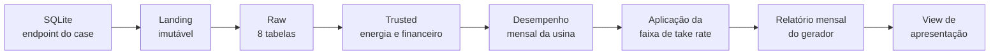

# Produto de dados — Relatório do Gerador

## Objetivo

Organizar em um único contrato mensal as informações necessárias para acompanhar
o desempenho das usinas e calcular os valores pertencentes à Lemon e aos
geradores.

## Consumidores e usos

O produto atende análises operacionais e financeiras, permitindo:

- acompanhar energia injetada, faturada e paga;
- comparar desempenho entre usinas e competências;
- identificar a faixa de take rate aplicada;
- calcular receita bruta, TUSD e repasses;
- alimentar relatórios e visualizações sem reconstruir os joins financeiros.

O fechamento usa maturação de 60 dias corridos após o vencimento vigente de
cada fatura. A competência de origem e o mês da liquidação permanecem
separados; recebimentos posteriores ao D+60 não reabrem o fechamento.

## Contrato publicado

| Contrato | Finalidade |
|---|---|
| `refined.relatorio_gerador_mensal` | Tabela completa e auditável do produto |
| `refined.vw_relatorio_gerador_apresentacao` | Interface enxuta para visualização |

Grain:

```text
gerador + usina + cod_distribuidora + dt_mes_referencia
```

## Construção



As tabelas financeiras e os instrumentos de pagamento são agregados antes de
chegar ao grain da usina. Essa decisão evita que múltiplos boletos ou PIX
multipliquem GMV, pagamentos ou créditos de energia.

## Regras centrais

### Quantidade mínima de injeção

```text
menor valor entre créditos injetados e geração prevista no contrato
```

### Desempenho Lemon

```text
créditos faturados associados a pagamentos
÷ quantidade mínima de injeção
```

### Aplicação do take rate

A faixa deve corresponder ao gerador e à distribuidora, estar vigente na
competência e conter o desempenho no intervalo mínimo inclusivo e máximo
exclusivo.

### Repasse principal

```text
receita bruta do gerador × (1 − take rate) − TUSD
```

A receita bruta do fechamento considera somente a parcela liquidada até D+60.
A TUSD é associada pelo mês explicitamente informado para desconto.

Multas e juros são divididos separadamente pelo mesmo take rate e consolidados
somente na view de apresentação.

## Qualidade e limitações

- as tabelas Trusted são reconstruídas por full refresh;
- a Refined insere cada fechamento
  maduro uma única vez;
- as procedures são executadas manualmente na operação atual;
- ausência ou sobreposição de faixa de take rate invalida o contrato esperado;
- o modelo usa o snapshot recebido no case e não define SLA de produção;
- Airflow é a evolução prevista para dependências, retries e observabilidade.

## Evidências

- [Descoberta das fontes](discovery/)
- [Validação e entendimento da view legada](validation/README.md)
- [Catálogo Trusted](trusted/README.md)
- [Contrato detalhado da Refined](refined/relatorio_gerador_mensal.md)
- [Arquitetura](architecture.md)
