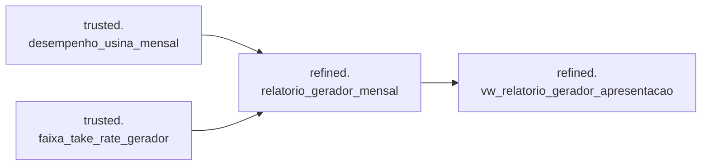

# Catálogo da camada Refined

A camada Refined publica o produto de dados final do case. Diferentemente dos
artefatos do dataset `validation`, seus objetos representam o contrato escolhido
para consumo.

| Objeto | Tipo | Responsabilidade |
|---|---|---|
| [`refined.relatorio_gerador_mensal`](relatorio_gerador_mensal.md) | Tabela | Consolidar desempenho, take rate, receitas e repasses por usina e mês |
| `refined.sp_carregar_relatorio_gerador_mensal` | Procedure | Aplicar vigência/faixa de take rate e carregar a tabela final |
| `refined.vw_relatorio_gerador_apresentacao` | View | Expor somente as métricas necessárias à visualização |

Fluxo:

O grain é gerador + usina + distribuidora + mês em todo o fluxo. A view
de apresentação não recalcula as regras de negócio: seleciona campos, converte
percentuais da escala decimal para 0–100 e consolida os repasses de principal,
multa e juros.
