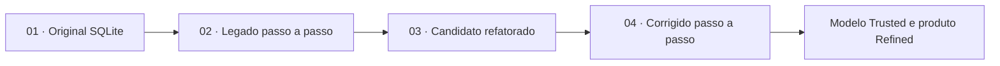

# Validação e entendimento da `generator_report`

Esta pasta documenta a engenharia reversa da view recebida no SQLite. Ela não
substitui a ingestão: a Cloud Run Function e o Cloud Run Job continuam sendo o
caminho oficial entre o endpoint do case, a landing e a camada Raw.

Os quatro primeiros SQLs em `sql/validation` formam uma sequência de
entendimento e comparação. Os scripts `05` e `06` verificam o contrato temporal
D+60 e o fechamento publicado.

## Fluxo



| Ordem | Arquivo | Papel |
|---:|---|---|
| 1 | [`01_generator_report_original_sqlite.sql`](../../sql/validation/01_generator_report_original_sqlite.sql) | Preserva a lógica recebida no SQLite como referência histórica |
| 2 | [`02_generator_report_legacy_step_by_step.sql`](../../sql/validation/02_generator_report_legacy_step_by_step.sql) | Traduz o legado para GoogleSQL e troca CTEs por temporárias inspecionáveis |
| 3 | [`03_generator_report_refactored_candidate.sql`](../../sql/validation/03_generator_report_refactored_candidate.sql) | Materializa uma view candidata com correções técnicas |
| 4 | [`04_generator_report_corrected_step_by_step.sql`](../../sql/validation/04_generator_report_corrected_step_by_step.sql) | Decompõe a lógica corrigida para diagnóstico e reconciliação |
| 5 | [`05_validate_temporalidade_d60.sql`](../../sql/validation/05_validate_temporalidade_d60.sql) | Valida flags, valores e agregações por competência e liquidação |
| 6 | [`06_validate_fechamento_refined.sql`](../../sql/validation/06_validate_fechamento_refined.sql) | Valida grain, maturação, fórmulas, TUSD e zeros de take rate |

## 01 — Original SQLite

É a evidência recebida com o case. Usa dialeto SQLite e não deve ser executado
no BigQuery. Sua presença permite rastrear decisões até a lógica original.

## 02 — Legado passo a passo

Reproduz o comportamento legado em GoogleSQL com tabelas temporárias. Permite
inspecionar grain, cardinalidade, filtros, joins e o ponto em que valores são
multiplicados ou alterados. Ao final, materializa
`validation.generator_report_formatado_em_temp_tables_result` e publica a view
`validation.generator_report_formatado_em_temp_tables`.

## 03 — Candidato refatorado

Cria `validation.generator_report_refactored_candidate`, corrigindo os riscos
de fanout, perda de centavos, descarte do valor proporcionalmente liquidado e
coerções implícitas. O termo `candidate` é intencional: essa view serviu para
validar a proposta e não é o produto final.

## 04 — Corrigido passo a passo

Expressa as correções do candidato em temporárias e materializa
`validation.generator_report_corrected_temp_tables`. Seu objetivo é comparar a
versão corrigida com o legado e explicar cada divergência.

## Produto escolhido

Depois da investigação, a solução definitiva foi organizada em entidades
reutilizáveis:

```text
raw
→ trusted.cliente_energia_mensal
→ trusted.faturamento_cliente_mensal
→ trusted.desempenho_usina_mensal
→ refined.relatorio_gerador_mensal
→ refined.vw_relatorio_gerador_apresentacao
```

## Documentação complementar

- [Descoberta e linhagem das colunas](generator_report_column_discovery.md)
- [Achados críticos](generator_report_critical_findings.md)

## Diagramas

| Etapa | Diagrama |
|---|---|
| Original SQLite | [generator_report_original_sqlite.svg](diagrams/generator_report_original_sqlite.svg) |
| Legado passo a passo | [generator_report_legacy_step_by_step.svg](diagrams/generator_report_legacy_step_by_step.svg) |
| Candidato refatorado | [generator_report_refactored_candidate.svg](diagrams/generator_report_refactored_candidate.svg) |

## Interpretação

- **FATO:** comportamento comprovado pelo schema, pelos dados ou pelo SQL;
- **HIPÓTESE:** interpretação plausível ainda não confirmada pelo negócio;
- **DESCONHECIDO:** não há evidência suficiente para concluir.

A referência original demonstra paridade técnica. O candidato demonstra uma
possível correção. O contrato final da entrega é a camada Refined.
